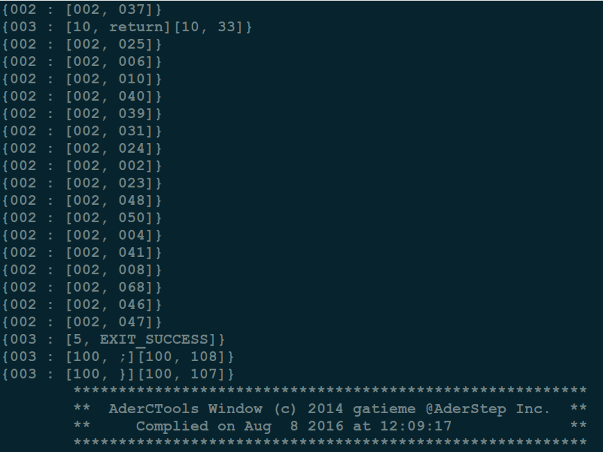

#AderCTools
-------

AderCTools是一个简单的编译器工具, 

目前完成了如下工作

*   词法分析Lexical

*   语法分析Parser

*   代码插桩Prop

#1	结构
-------


| 目录 | 描述 |
|:-------:|:-------:|
| Config  | 配置文件, 存储了编译CTools工具的一些配置宏等信息 |
| Lexical | 词法分析器 |
| Parser  | 语法分析器, 使用SLR(1)语法分析进行, 并最终生成了一个抽象语法树 |
| Prop    | 基于语法分析的插桩器, 插桩器的工作是在源代码中插入一些探针<br>从而监测程序的执行路径等信息 |
| Tools   | 词法分析和语法分析过程中用到的一些工具信息, 比如双缓冲区buffer等 |
| Global  | 系统的全局入库地址, 词法分析和语法分析器以及插桩器的入口函数main都在这里 |
| .obj    | 系统编译过程中生成的目标文件的存放路径 |
| bin     | 存放可执行文件的目录 |


#2	How to make
-------


```c
make objdir
mkdir res # obly for windows
make
```

#3	How to run
-------


##3.1	被测程序源代码
-------

测试代码, 位于./bin/test.c

```cpp
#include <stdio.h>
#include <stdlib.h>


int main(void)
{

    return EXIT_SUCCESS;
}
```


##3.2	词法分析
-------


运行词法分析器

```cpp
make run_lexcial
```

对test.c进行词法分析的结果


##3.3	语法分析
-------

运行语法分析器

```cpp
make run_parser
```

对test.c进行语法分析的结果


